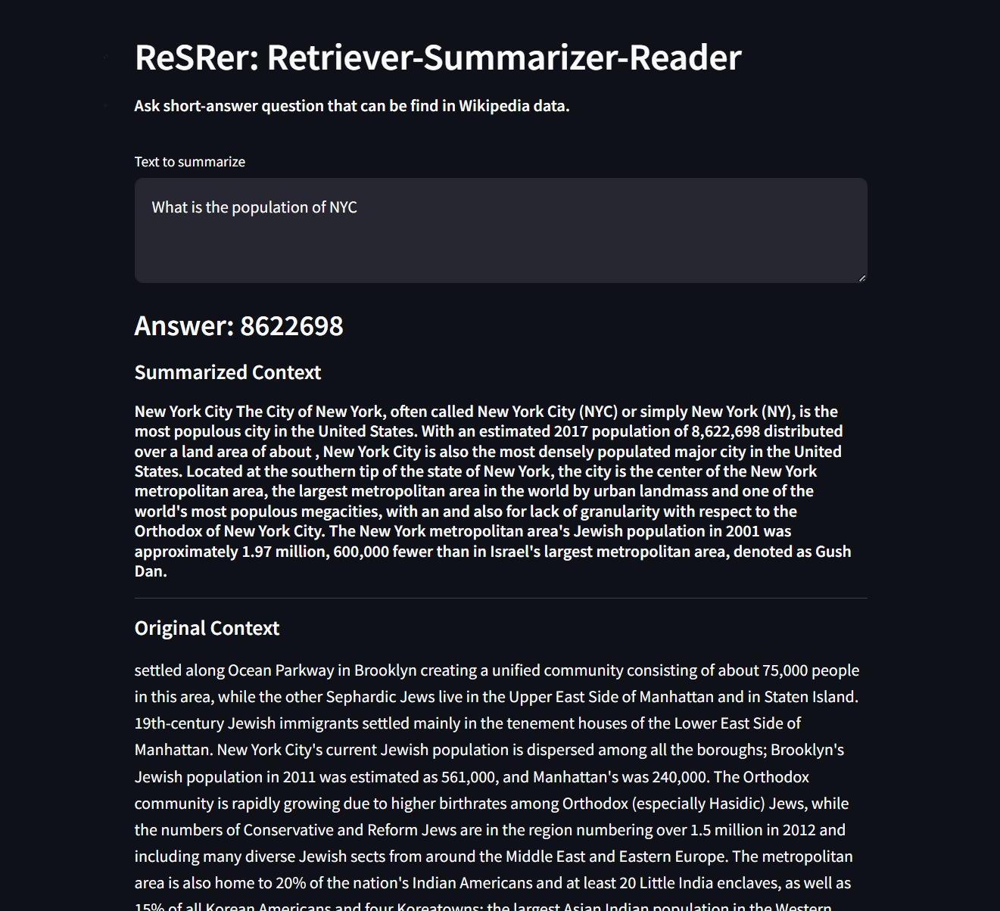

# ReSRer

[](https://huggingface.co/spaces/seonglae/resrer-demo)

## Get Started

### 1. Install dependencies

```bash
git clone https://github.com/seonglae/ReSRer
cd ReSRer
rye sync
# or
pip insatll .
# for training
pip install git+https://github.com/NVIDIA/TransformerEngine.git@stable
pip install --force-reinstall typing-extensions==4.5.0
pip uninstall deepspeed
pip install deepspeed
pip uninstall -y apex
```

### 2. create .env

```bash
MILVUS_PW=
MILVUS_HOST=resrer
```

### 3. QA pipeline

```bash
python qa_pipeline.py
```

# Index to Vector DB

`indexing.json`

- check embedding dimension of tei
- subset target
- streaming or not
- collection name

```bash
python indexing.py
```

# TEI

[install guide](https://texonom.com/434f6f39b88342ea9e5156bd8501d8c4)

```
npm i -g pm2
model=
pm2 start data/tei.json
```
